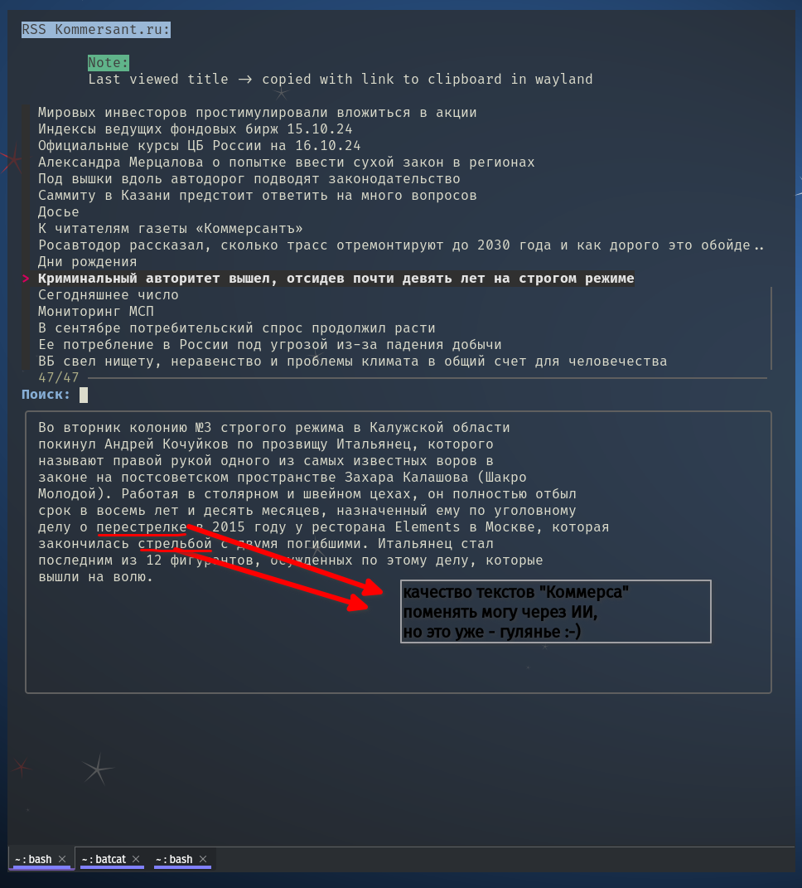
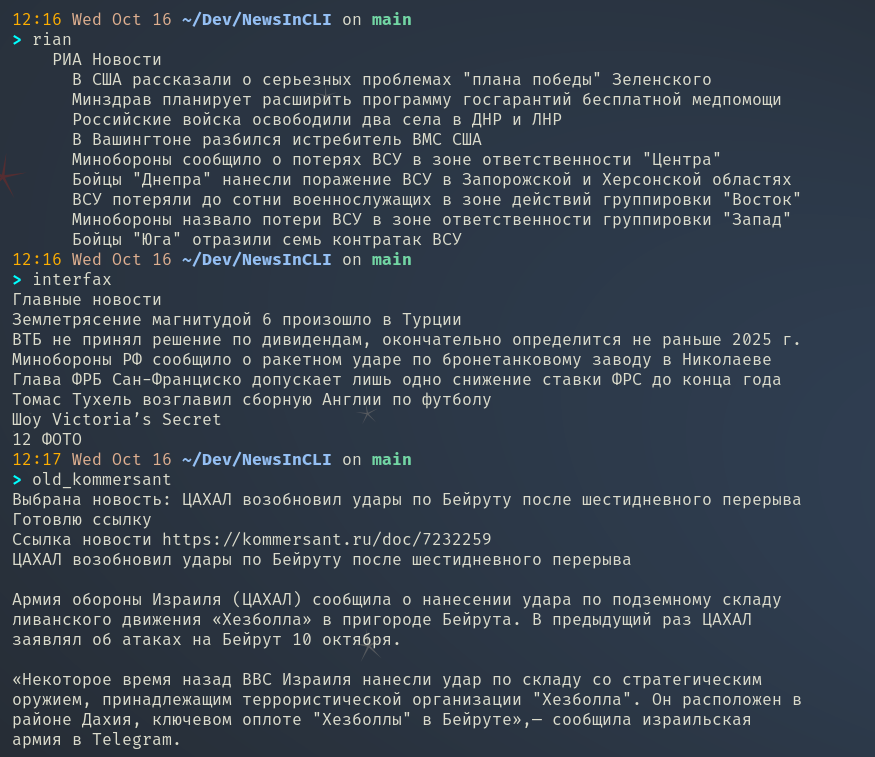

# NewsInCLI

Here's my collection of quick and minimalistic news-readers.

**Idea:**

- get just the news, skip all the junk and bloat
- easy to share, auto-clipboarding

Updated kommers uses and depends on Kommersant rss feed.

Kommersant changes encodings sometimes. Left prompt in the script,
so if problems (кракозябы) change accordingly.

And if they change or modify fields in their rss,
the script might not work as planned.

But will try to keep it updated. 

## Former iterations 

*What's next?*

Bash parsing in mind...
